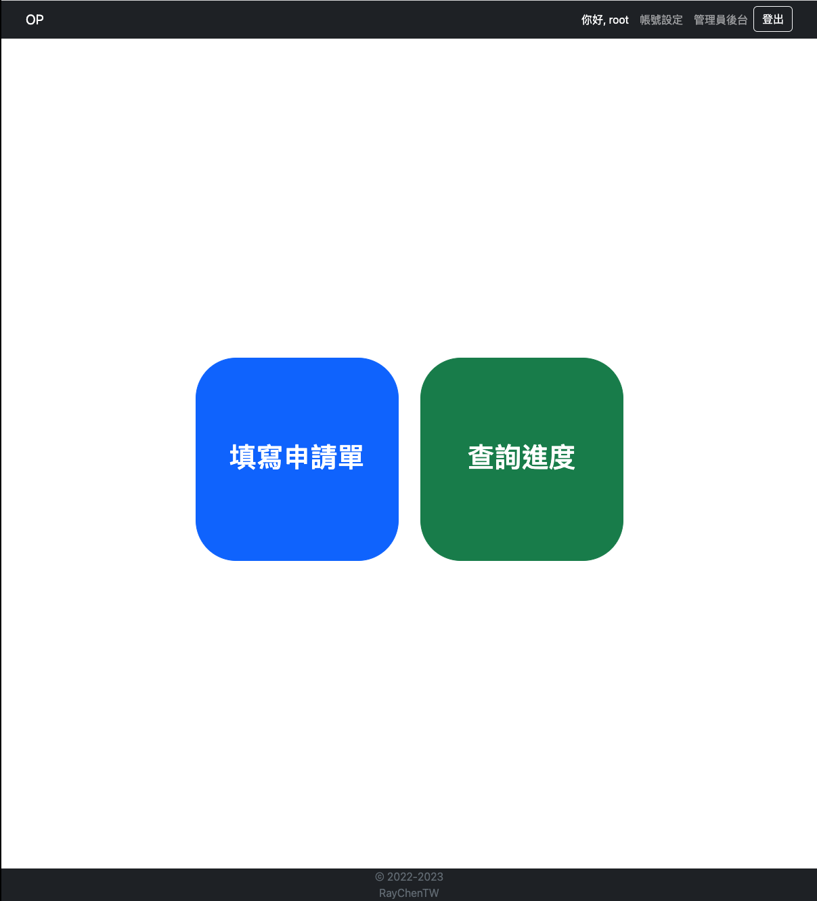
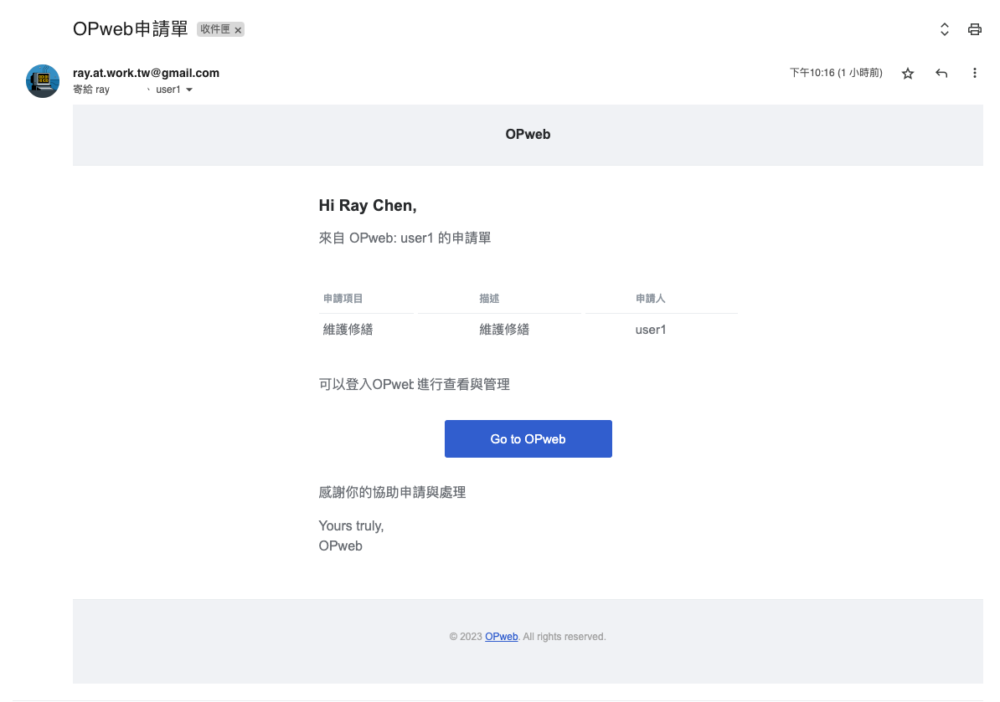
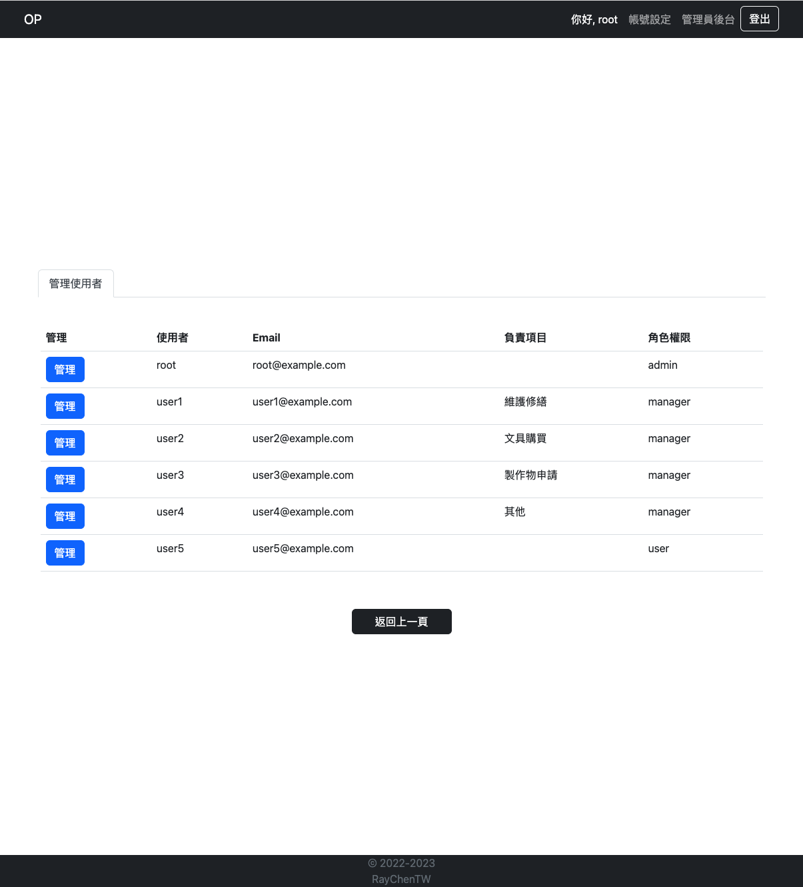
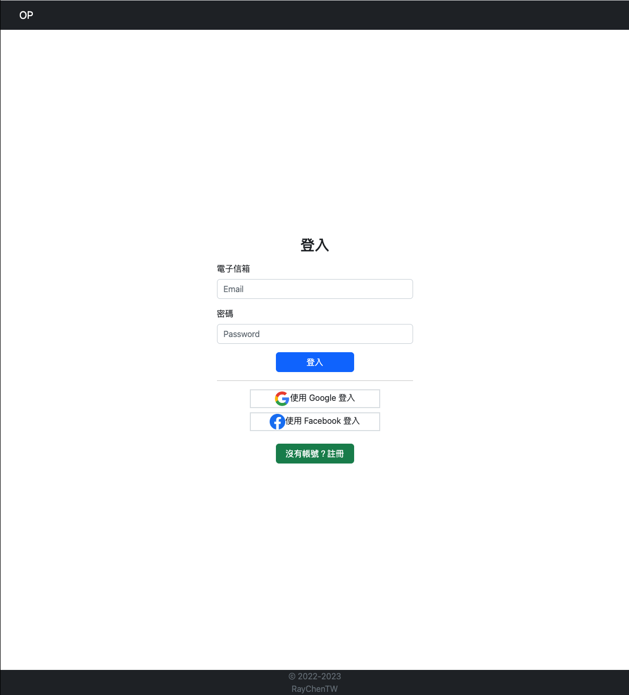
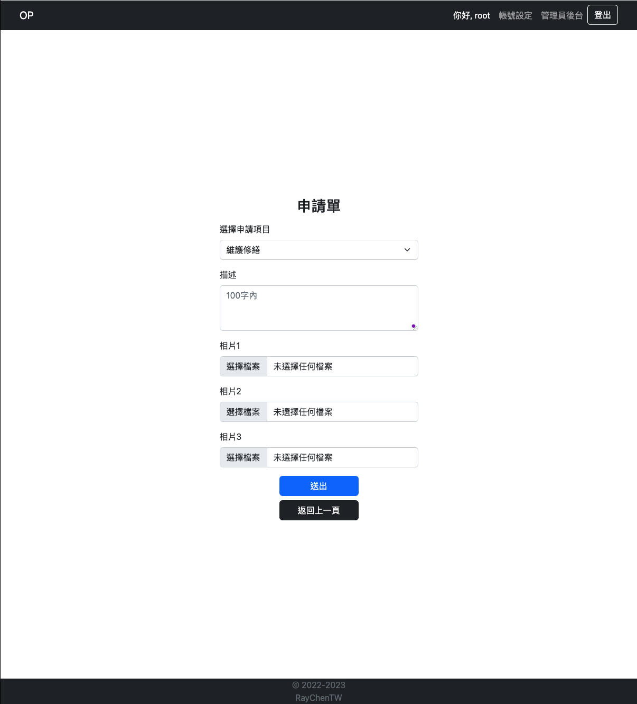
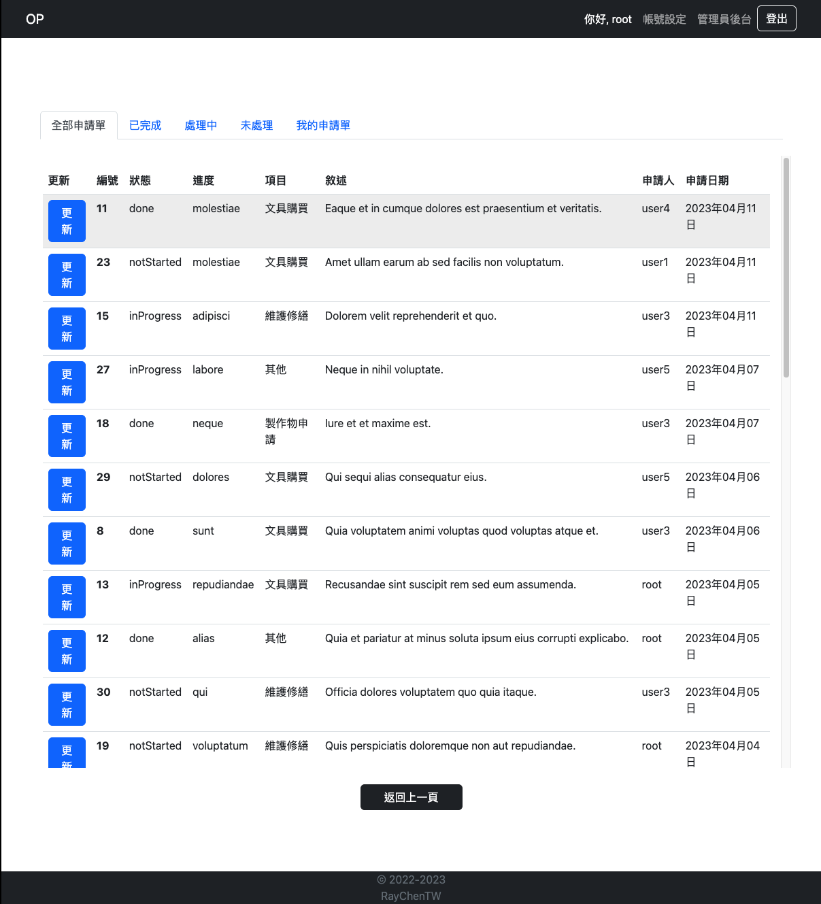

- # OPweb app
- An application management platform.
  
- OP is short for "operations," and this app was designed to help physical stores with their day-to-day operations tasks.
- This app serves as a platform for collecting applications, making it easy for users to apply and allowing each application to be sent directly to the relevant manager via email. Before this platform, operation managers had to deal with applications coming in from various sources, such as verbal communication, text messages, and mail.
- The main idea behind this app is to make operations run smoother and faster by going digital. With this app, we can gather all applications in one place and easily track their progress. Plus, we can automate the whole process by sending out email notifications to the relevant manager when a new application is submitted. It's all about making things easier and more efficient for everyone involved!
  
- The OP website was built using Node.js, Express, Handlebars, and MySQL.
- ## Description
- ### As admin
  - Admin can see all applications and manage it.
  - Admin can see all users information and manage it(to adjust role or to set category belongs).
    
- ### As user

  - User can register and signin/out the app(by local or by Google and FB).
    
  - User can edit their own account.
  - User can send application about 4 categories 'maintenance, communication material, purchase and others'.
  - User can attach 3 images for each application.
    
  - User can see all applications and also see them by different status.
    

- ## Installation
- ### Clone the project to local

```
git clone https://github.com/RayYangTW/OP-webapp.git
```

- ### Enter the project folder

```
cd OP-webapp
```

- ### Install

```
npm install
```

- ### Create .env as .env.example required

```
please follow the file description to set.

```

### Update the config/config.json

```
"development": {
  "username": "<username>",
  "password": "<mysql_workbench_password>",
  "database": "op",
  "host": "127.0.0.1",
  "dialect": "mysql"
  }
```

- ### Create the database in MySQL

```
create database op;
```

- ### Execute migration to create the data table

```
$ npx sequelize db:migrate
```

- ### Create the seed data

```
$ npx sequelize db:seed:all
```

- ### Run the app

```
$ npm run dev
```

When everything goes well it will show: Express app is running on http://localhost: 3000.

- ### If you want to stop the process

```
ctrl + c
```

- ## Test accounts

  | Admin    |                  |
  | -------- | ---------------- |
  | Email    | root@example.com |
  | Password | 12345678         |

  | User     |                   |
  | -------- | ----------------- |
  | Email    | user1@example.com |
  | Password | 12345678          |

- ## Author
- [Ray Chen] (https://github.com/RayYangTW)
